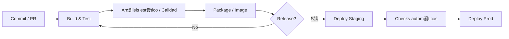

<!--
**ajunquit/ajunquit** is a ✨ _special_ ✨ repository because its `README.md` (this file) appears on your GitHub profile.

Here are some ideas to get you started:

- 🔭 I’m currently working on ...
- 🌱 I’m currently learning ...
- 👯 I’m looking to collaborate on ...
- 🤔 I’m looking for help with ...
- 💬 Ask me about ...
- 📫 How to reach me: ...
- 😄 Pronouns: ...
- ⚡ Fun fact: ...
-->
<!-- Banner -->

# 隆Hola, soy **Alejandro Junquit**! 馃憢  
**Senior Full-Stack Developer (.NET + Angular) | DevOps Enthusiast | Software Architect**

---

### 馃殌 Sobre m铆
- Construyo soluciones **end-to-end** con **.NET 8 / C#** y **Angular**, practicando **Clean Architecture, DDD y CQRS**.  
- Me apasiona automatizar con **CI/CD**, **GitHub Actions** y buenas pr谩cticas de ingenier铆a.  
- He trabajado en modernizaci贸n de legados, APIs robustas, frontends SPA/SSR y despliegues en **Azure/AWS**.  
- Actualmente profundizando en **patrones de dise帽o para pipelines CI/CD** y arquitectura modular con **polyrepos**.

---

### 馃О Tech Stack (selecci贸n)
`C#` 路 `.NET 8` 路 `ASP.NET Core` 路 `EF Core` 路 `xUnit` 路 `MSTest`  
`Angular (16-20)` 路 `TypeScript` 路 `RxJS` 路 `Tailwind`  
`SQL Server` 路 `Dapper` 路 `Redis`  
`GitHub Actions` 路 `Docker` 路 `Azure` 路 `AWS`  
`Clean Architecture` 路 `DDD` 路 `CQRS` 路 `REST` 路 `OpenAPI`

<!-- Badges r谩pidos -->

  
  
  
  
  
  
  
  

---

### 馃И Filosof铆a de c贸digo
- **Sencillez primero**: SOLID, DRY/KISS, pruebas desde el d铆a 1.  
- **Observabilidad**: logs estructurados, m茅tricas y trazas.  
- **Automatizaci贸n**: pipelines reproducibles, versionado sem谩ntico y dependencias actualizadas.

---

### 馃敆 Proyectos destacados
- **[Design.Patterns](https://github.com/ajunquit/Design.Patterns)** 鈥?Implementaciones de patrones de dise帽o en .NET para soluciones robustas y escalables.  
- **[Ecuador.ID](https://github.com/ajunquit/Ecuador.ID)** 鈥?Librer铆a para validaci贸n de c茅dula/RUC ecuatoriano.  
- **[CD.Cooper](https://github.com/ajunquit/CD.Cooper)** 鈥?Script/plantilla en PowerShell para acelerar despliegues continuos.  
- **[HandsOn.Labs.kTodo](https://github.com/ajunquit/HandsOn.Labs.kTodo)** 鈥?API .NET 8 con Clean Architecture, CQRS, pruebas y DI con MediatR.  
- **[Katas](https://github.com/ajunquit/Katas)** 鈥?Colecci贸n de ejercicios y TDD en C#.

> 驴Quieres colaborar? 隆Abre un *issue* o env铆a un PR! 馃檶

---

### 馃搱 Estad铆sticas

  

  

---

### 馃Л Flujo t铆pico de mis proyectos

---

### 馃 驴Hablamos?
- Si te interesa **mentor铆a, revisi贸n de arquitectura o CI/CD**, deja un **issue** en cualquier repo.  
- Tambi茅n puedo apoyar en migraciones **.NET Framework 鈫?.NET 8** y adopci贸n de **Angular standalone**.

---

> _鈥淎utomatiza todo lo repetible y dise帽a para cambiar: la velocidad llega como consecuencia.鈥漘
